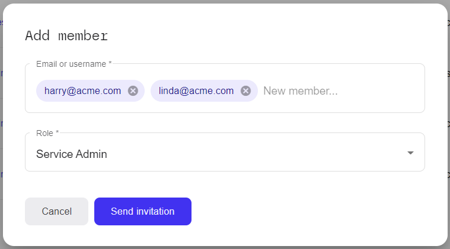

This page allows you to create, change and remove workspace members.

* You can search for one or multiple users by using the "Filter" input field, where
  you can enter a full or partial name.

The page shows you a list of all members of the currently selected workspace,
based on the currently set filter. If no filter is set, all users are listed.

## Adding new members

To add one or multiple new members, click the "Add Member" button in the
lower right corner. It will open this dialog:

