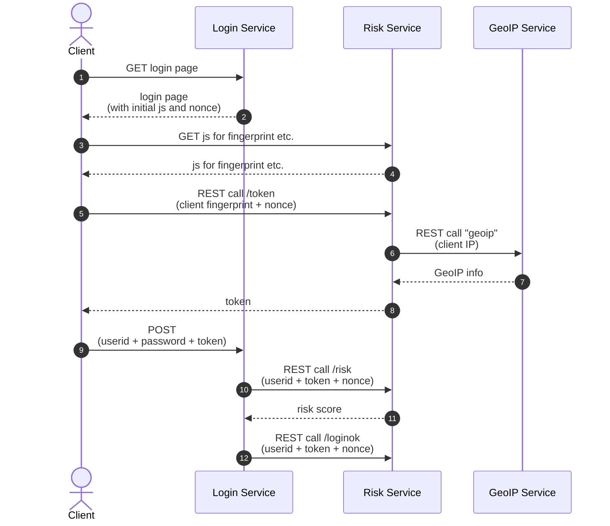

# Integration of a sorbay_risk service

***TODO risk service:*** Adapt texts from ciam...

This guide will show you how to integrate your service into sorbay_ciam using our demo ui application.

Let's assume that your domain name is "example.com" and you have already created a service with the name "my-ciam-service".

## Configure the sorbay_risk service

**TODO** Sketch: Need only API-Key from config (autogenerated or set manually)

Navigate to the "Settings" of your service, then go to the "Pages" tab.

Configure the "Page Locations" section as follows:

Now scroll down, until you reach the "CORS" and "Custom" sections. Enter the values according to the following illustration.

You will have to create a CNAME record with the DNS provider with which the domain is registered, with the value that's provided in this view.

Self-Service flows such as Login, Registration, Updating Settings support two successful response modes:

* For browsers of a server-side application, identified by the `Accept: text/html header`, the response will be a redirection.
* For API clients, such as a client-side AJAX application, identified by the `Accept: application/json header`, the response will be in JSON.

The browser redirects work just for regular browser requests. If you are using an API Client, as  mentioned above, the application must redirect the user to the right endpoint in the application. Since our [pre-built demo ui container](https://quay.io/usp/sorbay-ciam-self-service:1.0.0) is a client-side application, it is required to provide the locations by means of environmental variables. 

## Configure your login service

**TODO** Sketch: Describe what needs to do on server (generate nonce, http callouts, etc.)
and what on client (include js, hidden fields, etc., also show the diagram with requests and responses)

Test if mermaid works in here... nope... to be seen if activate it or use image...

