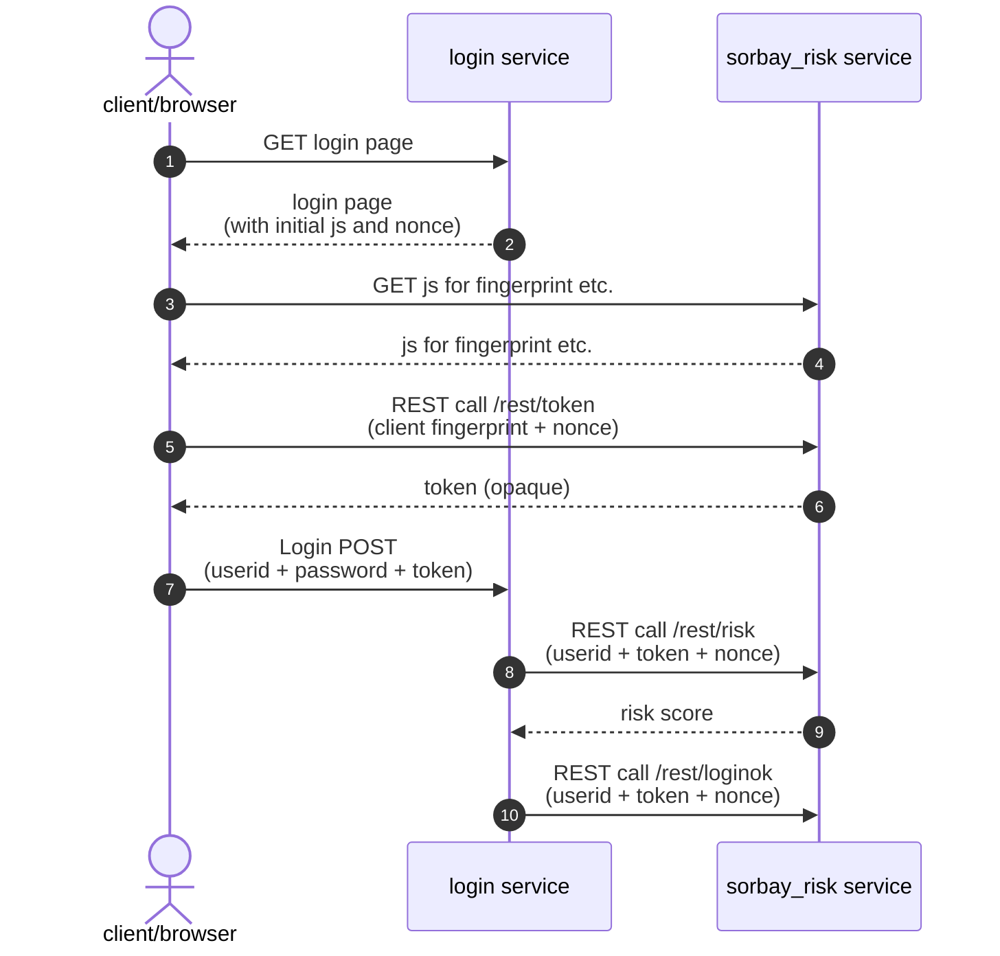

# Integration of a sorbay_risk service

This guide will show you how to integrate your login service with the sorbay_risk service.

Let's assume that you have already created a sorbay_risk service.

## Configure the sorbay_risk service

Navigate to the "Settings" of your service, then go to the "Configuration" tab.

Configure at least one API-key.
It will be needed in your login service for REST calls to the sorbay_risk service.

## Configure your login service

For simplicity, let's assume that your login service provides users who want to log in
with a simple login form with userid and password fields, plus has a hidden "token" field:

- **userid**: Text field
- **password**: Password field
- **token**: Hidden field

That might of course be different in practice, but what is crucial is that there should be a means to at least weakly authenticate a user (more precisely a userid) before using the sorbay_risk service.

<span style="color:red">***TODO***</span> Where would the base URL be obtained from? Shown in the service GUI? Would it be derived from the service name, e.g, as imagined below `https://risk.sorbay.com/{service-name}`??

The base URL of the sorbay_risk service depends on the service name, assuming `https://risk.sorbay.com/myriskservice` below.

Here is the typical flow of requests and responses in case of a successful login:



#### 1. 🠚 GET login page

A user goes to the login location in their browser/client, maybe redirected when trying to access a protected application or going directly to the login page.

#### 2. 🠘 Login page (with initial js and nonce)

Your login service sends back a login page with form fields for **userid** and **password**,
plus a hidden field named **token**, and the following JavaScript:

```javascript
<script>
  function sorbayGetSetToken() {
    const baseUrl = 'https://risk.sorbay.com/myriskservice';
    var nonce = "603276204091730547274816";
    import(baseUrl + '/resources/sorbay-risk.min.js')
      .catch(e => { throw new Error('client-error: import ' + baseUrl + '/resources/sorbay-risk.min.js failed: ' + e); })
      .then(js => js.sorbayGetToken(baseUrl, nonce))
      .catch(e => e.message.startsWith('client-error: ') ? e.message : 'client-error: sorbayGetToken() failed: ' + e)
      .then(token => {
        console.log('SLS: setting token in form to: ' + token);
        document.getElementById('token').value = token;
      });
  }
  sorbayGetSetToken();
</script>
```

**IMPORTANT**: The **nonce** value must be generated as a hard to guess random string by the login service on the *server side* (***not*** on the browser/client) and must be remembered on the server during the login.
The nonce is later used to prevent some attacks.

#### 3. 🠚 GET js for fingerprint etc.

The above JavaScript is run immediately (while the user is free to enter username and password in parallel). It fetches further JavaScript from the sorbay_risk service in order to calculate a browser/client fingerprint.

#### 4. 🠘 js for fingerprint etc.

The received JavaScript is also run immediately.

#### 5. 🠚 REST call /rest/token (client fingerprint + nonce)

The JavaScript determines the browser/client fingerprint and makes a rest call to the sorbay_risk service at `https://risk.sorbay.com/myriskservice/rest/token`, passing both **fingerprint** and **nonce**.

(Note that the API-key is not used in that callout; usage of the API-key is restricted to your login service, the API-key should never be passed to the client.)

#### 6. 🠘 token (opaque)

The sorbay_risk service returns the **token**, which is just an opaque string to the client. It contains in encrypted form all collected attributes (IP, User-Agent, fingerprint, plus derived attributes like country, etc.) and the nonce for later comparison. It also contains a validity period and a unique id to prevent replay attacks.

In the JavaScript above, the token is written to the hidden **token** field.

#### 7. 🠚 Login POST (userid + password + token)

The user enters userid and password and submits them, posting the login to your login service along with the token.

(Detail: Ideally, the submit button would only become active once the token had been obtained.)

#### 8. 🠚 REST call /rest/risk (userid + token + nonce)

The login service validates userid/password and, if ok, makes a REST call to the `https://risk.sorbay.com/myriskservice/rest/risk` location on the sorbay_risk service, passing **userid**, **nonce** and **token**, plus the **API-key** as `X-API-Key` HTTP request header.

#### 9. 🠘 risk score

The sorbay_risk service makes various validations, including:

- The API-key must match any configured ones.
- The token must still be valid (not expired).
- The nonce in the token must be equal to the directly posted nonce.

If all validations pass, the sorbay_risk service calculates the risk score and returns it.

#### 10. 🠚 REST call /rest/loginok (userid + token + nonce)

Your login service receives the risk score and is free what to do based on its value.

For example, if the risk score is lower than 0.4, a second factor authentication (SMS, etc.) could be skipped. Or if the risk score is above a certain value, an email could be sent to the user to inform of the login attempt "from a new location".

Whenever your login service decides that login with that user was successful, your login service makes a REST call to the `https://risk.sorbay.com/myriskservice/rest/loginok` location at the sorbay_risk service to signal that, with the same parameters as for the risk call futher above. Only then does the sorbay_risk service store attributes (partially obfuscated) in its database for future risk score evaluations.

Note that this second REST call is necessary for **security** reasons: An attacker in possession of a valid userid/password pair could get past the password validation, but then fail when asked for a second factor. If those attempts that failed in the end were all stored as successful logins at the sorbay_risk service, after some attempts the risk score would get so low that the login service might no longer ask for a second factor.
