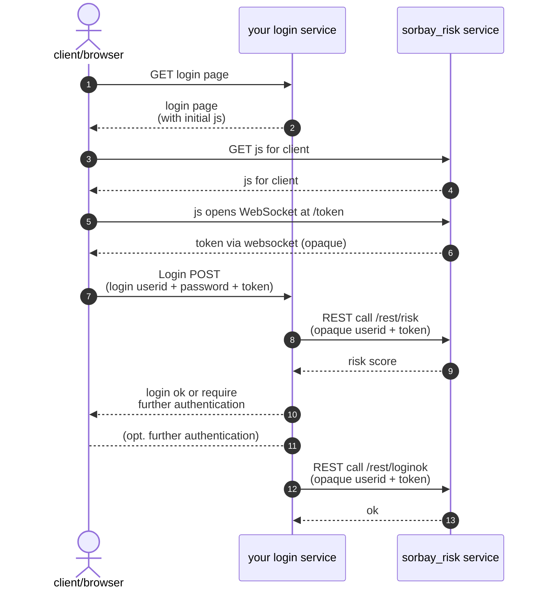

# Integration of a sorbay_risk service

This guide will show you how to integrate your login service with the sorbay_risk service.

Make sure you first created a sorbay_risk service.

## Configure the sorbay_risk service

Navigate to the "Settings" of your service, then go to the "Configuration" tab.

Configure at least one API key.
It will be needed in your login service for REST calls to the sorbay_risk service.

## Configure your login service

For simplicity, let's assume that your login service provides users who want to log in
with a simple login form with userid and password fields, plus has a hidden "token" field:

- **userid**: Text field
- **password**: Password field
- **token**: Hidden field

That might of course be different in practice, but what is crucial is that there should be a means to at least weakly authenticate a user (more precisely the userid) before using the sorbay_risk service.

To get the base URL of your sorbay_risk service, you will find in the "General" settings tab a button to copy the URL of the REST-API.


The base URL of the sorbay_risk service depends on the service ID and has the notation `https://<SERVICE_ID>.cloud.sorbay.com`.
In this guide we assume the base URL is `https://riskid.cloud.sorbay.com/` below.

## Authentication Flow

Here is the typical flow of requests and responses in case of a successful login:



*General note:* If any of the steps below fails such that no risk score can be obtained from the sorbay_risk service, this should usually be treated like a maximal risk score (10.0) for obvious security reasons.

**1. GET login page**

A user goes to the login location in their browser/client
(directly or redirected when trying to access a protected application).

**2. Login page (with initial js)**

Your login service sends back a login page with form fields for **userid** and **password**,
plus a hidden field named **token**, and the following JavaScript:

```javascript
<script>
  function sorbaySetTokenInForm(token) {
    console.log('setting token in form to: ' + token);
    document.getElementById('token').value = token;
  }
  function sorbayGetSetToken() {
    const baseUrl = 'https://riskid.cloud.sorbay.com';
    import(baseUrl + '/resources/sorbay-risk.min.js')
      .catch(e => { throw new Error('client-error: import ' + baseUrl + '/resources/sorbay-risk.min.js failed: ' + e); })
      .then(js => js.sorbayGetToken(baseUrl, sorbaySetTokenInForm))
      .catch(e => e.message.startsWith('client-error: ') ? e.message : 'client-error: sorbayGetToken() failed: ' + e);
  }
  sorbayGetSetToken();
</script>
```

**3. GET js for client**

The above JavaScript is run immediately (while the user is free to enter username and password in parallel). It fetches further JavaScript from the sorbay_risk service in order to collect/measure client attributes.

**4. js for client**

The received JavaScript also runs immediately.

**5. js opens WebSocket at /token**

The JavaScript opens a WebSocket to `wss://riskid.cloud.sorbay.com/token`.

Note: The API key is not used here. Usage of the API key is restricted to the REST calls of your login service described further below. The API key should never be given/passed to the client.

**6. token (opaque)**

Within the websocket channel additional client attributes are determined. As last action before closing the websocket
connection, the sorbay_risk service returns the opaque **token**. The token is required to calculate the final
risk score in the next steps. The token is only valid for a certain period of time and can be used only once
to prevent e.g. replay attacks.

In the JavaScript above, the token is written to the hidden **token** field.

**7. Login POST (login userid + password + token)**

The user enters login userid and password and submits them, posting them to your login service along with the token.

Ideally, the submit button would only become active once the token had been obtained.

**8. REST call /rest/risk (opaque userid + token)**

The login service validates userid/password and, if correct, makes a REST call to the `https://riskid.cloud.sorbay.com/rest/risk`
location on the sorbay_risk service, passing an **opaque userid** and the **token**, plus the **API key** as `X-API-Key` HTTP request header.

!!! info "opaque userid"
    The opaque userid should be unique and unchanging per user,
    but it should not be possible to derive it from login userid and/or API-Key.
    Formally, the opaque userid is limited to max 128 characters,
    where upper and lower case letters and numbers are allowed, as well as '+/=-_',
    i.e. covers hex-, base64- and base64url-encodings.
    Technical approaches for the opaque userid would include
    a randomly generated userid  that is stored along other user data
    somewhere where only the login service has access,
    or an HMAC based on a secret key that only the login service knows.

**9. risk score**

The sorbay_risk service validated the token before calculating the risk score and returns it.

Your login service receives the risk score and is free what to do based on its value.

For example, if the risk score is lower than 0.4, a second factor authentication (TOTP, etc.) could be skipped.
Or if the risk score is above a certain value, an email could be sent to the user to inform of the login attempt "from a new location/client".

It's not recommended to block a login attempt entirely based on the risk score. Depending on the feature changes it could 
prevent legitimate user from accessing your service.

**10. login ok or require further authentication**

Your login service grants access to the user if the risk score was deemed low enough, otherwise it initiates further authentication steps.

**11. Optional further authentication steps**

Optionally further authentication steps between client and your login service.

**12. REST call /rest/loginok (opaque userid + token)**

Whenever your login service decides that login with that user was successful, your login service must make a REST call
to `https://riskid.cloud.sorbay.com/rest/loginok` to signal that to the sorbay_risk service.
Only then does the sorbay_risk service store the gathered attributes from the latest login attempt in its datastore
for future risk score evaluations.

**13. ok**

The sorbay_risk service confirms that it successfully recorded the login attributes.
