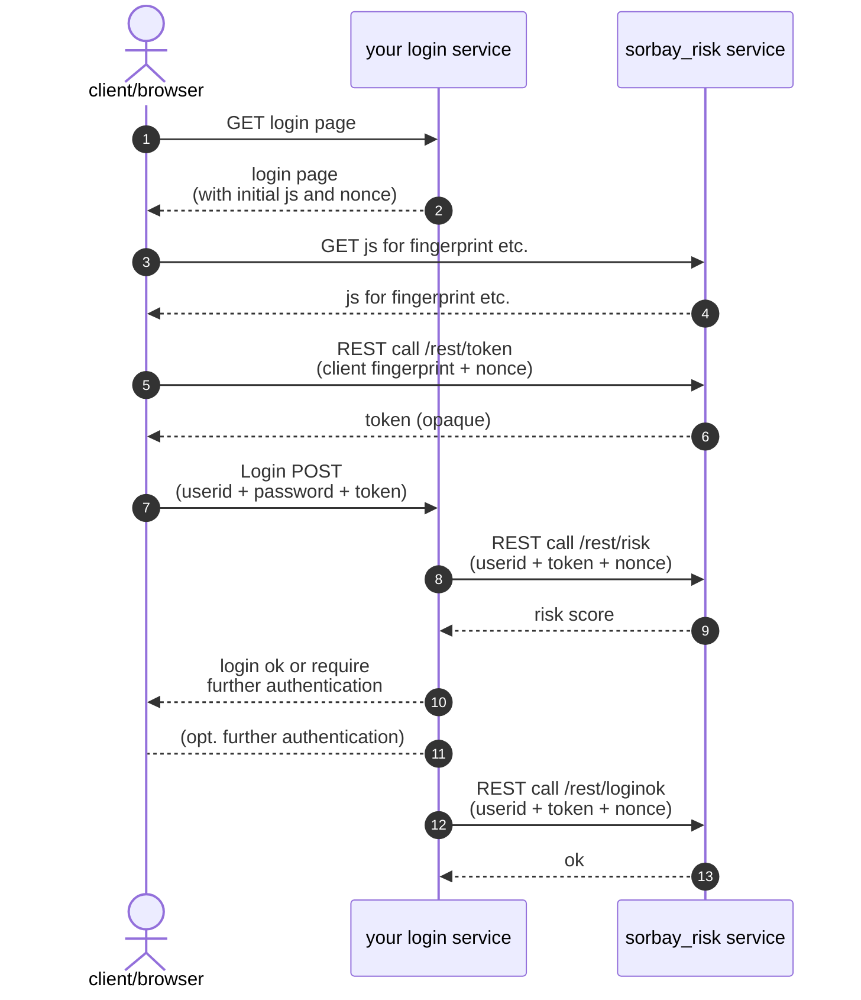

# Integration of a sorbay_risk service

This guide will show you how to integrate your login service with the sorbay_risk service.

Let's assume that you have already created a sorbay_risk service.

## Configure the sorbay_risk service

Navigate to the "Settings" of your service, then go to the "Configuration" tab.

Configure at least one API key.
It will be needed in your login service for REST calls to the sorbay_risk service.

## Configure your login service

For simplicity, let's assume that your login service provides users who want to log in
with a simple login form with userid and password fields, plus has a hidden "token" field:

- **userid**: Text field
- **password**: Password field
- **token**: Hidden field

That might of course be different in practice, but what is crucial is that there should be a means to at least weakly authenticate a user (more precisely the userid) before using the sorbay_risk service.

<span style="color:red">***TODO***</span> Where would the base URL be obtained from?<br>
=> could be shown in the service GUI (selectable to copy and/or button to copy to clipboard)<br>
=> if so, would need to add documentation for that additional field

The base URL of the sorbay_risk service depends on the service name, let's assume the base URL is `https://risk.sorbay.com/myriskservice` below.

Here is the typical flow of requests and responses in case of a successful login:



#### 1. 🠚 GET login page

A user goes to the login location in their browser/client
(directly or redirected when trying to access a protected application).

#### 2. 🠘 Login page (with initial js and nonce)

Your login service sends back a login page with form fields for **userid** and **password**,
plus a hidden field named **token**, and the following JavaScript:

```javascript
<script>
  function sorbayGetSetToken() {
    const baseUrl = 'https://risk.sorbay.com/myriskservice';
    var nonce = "603276204091730547274816";
    import(baseUrl + '/resources/sorbay-risk.min.js')
      .catch(e => { throw new Error('client-error: import ' + baseUrl + '/resources/sorbay-risk.min.js failed: ' + e); })
      .then(js => js.sorbayGetToken(baseUrl, nonce))
      .catch(e => e.message.startsWith('client-error: ') ? e.message : 'client-error: sorbayGetToken() failed: ' + e)
      .then(token => {
        console.log('setting token in form to: ' + token);
        document.getElementById('token').value = token;
      });
  }
  sorbayGetSetToken();
</script>
```

**IMPORTANT**: The **nonce** value must be generated as a hard-to-guess random string by the login service on the *server side* (***not*** on the browser/client) and must be remembered on the server during the login.
The nonce is later used to prevent some attacks.

#### 3. 🠚 GET js for fingerprint etc.

The above JavaScript is run immediately (while the user is free to enter username and password in parallel). It fetches further JavaScript from the sorbay_risk service in order to calculate a browser/client fingerprint.

#### 4. 🠘 js for fingerprint etc.

The received JavaScript also runs immediately.

#### 5. 🠚 REST call /rest/token (client fingerprint + nonce)

The JavaScript determines the browser/client fingerprint and makes a rest call to the sorbay_risk service at `https://risk.sorbay.com/myriskservice/rest/token`, passing both **fingerprint** and **nonce**.

(Note that the API key is not used in that callout; usage of the API key is restricted to your login service, the API key should never be given/passed to the client.)

#### 6. 🠘 token (opaque)

The sorbay_risk service returns the **token**, which is just an opaque string to the client. It contains in encrypted and signed form all collected attributes (IP, User-Agent, fingerprint, plus derived attributes like country, etc.) and the nonce for later comparison. It also contains a validity period and a unique id to further prevent replay attacks.

In the JavaScript above, the token is written to the hidden **token** field.

#### 7. 🠚 Login POST (userid + password + token)

The user enters userid and password and submits them, posting them to your login service along with the token.

(Detail: Ideally, the submit button would only become active once the token had been obtained.)

#### 8. 🠚 REST call /rest/risk (userid + token + nonce)

The login service validates userid/password and, if correct, makes a REST call to the `https://risk.sorbay.com/myriskservice/rest/risk` location on the sorbay_risk service, passing **userid**, **nonce** and **token**, plus the **API key** as `X-API-Key` HTTP request header.

#### 9. 🠘 risk score

The sorbay_risk service makes various validations, including:

- The API key must be equal to one of the configured API keys.
- It can decipher the token and validate its signature.
- The token must not have expired.
- The nonce in the token must be equal to the directly posted nonce.

If all validations pass, the sorbay_risk service calculates the risk score and returns it.

Your login service receives the risk score and is free what to do based on its value.

For example, if the risk score is lower than 0.4, a second factor authentication (SMS, etc.) could be skipped. Or if the risk score is above a certain value, an email could be sent to the user to inform of the login attempt "from a new location".

(The general recommendation is to first operate in mode where the risk score is calculated and logged, but no decisions are made based on it. After gaining some experience with how the risk score behaves in your specific setup and with your specific classes of users and their habits, start implementing different behavior depending on the risk score and maybe other attributes related to the user.)

#### 10. 🠘 login ok or require further authentication

You login service logs in the user if the risk score was deemed low enough, otherwise initiates further authentication.

#### 11. (opt. further authentication)

Optionally further authentication steps between client and your login service.

#### 12. 🠚 REST call /rest/loginok (userid + token + nonce)

Whenever your login service decides that login with that user was successful, your login service makes a REST call to the `https://risk.sorbay.com/myriskservice/rest/loginok` location at the sorbay_risk service to signal that to the sorbay_risk service, with the same parameters as for the risk call further above. Only then does the sorbay_risk service store the attributes (partially hashed in special way with a secret for privacy reasons) in its database as the basis for future risk score evaluations.

#### 13. 🠘 ok

The sorbay_risk service confirms that it successfully recorded the login as successful.
