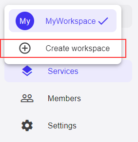

## Workspaces

All of your workspaces are available through the top-most navigation entry
on the left side:

### Creating new workspace

To create a new workspace, select the last popup menu option, "Create workspace":

Enter a name for the new workspace. The new workspace will be created
and immediately be selected in the workspace selector in the navigation.

### Editing workspace

To change settings of a workspace - such as the name - chose the "Settings" option:

It will open the [settings page](settings.md) which allows you to change
workspace settings, cede ownership of the workspace to another user, delete the
workspace etc.

### Deleting workspace

On the "Settings" page you can delete the currently selected workspace by clicking
the "Delete workspace" button in the "Workspace deletion" section of the screen.
After confirming the deletion by clicking "Yes" in the popup confirmation dialog,
the workspace and all associated services and resources will be removed irrevocably.

